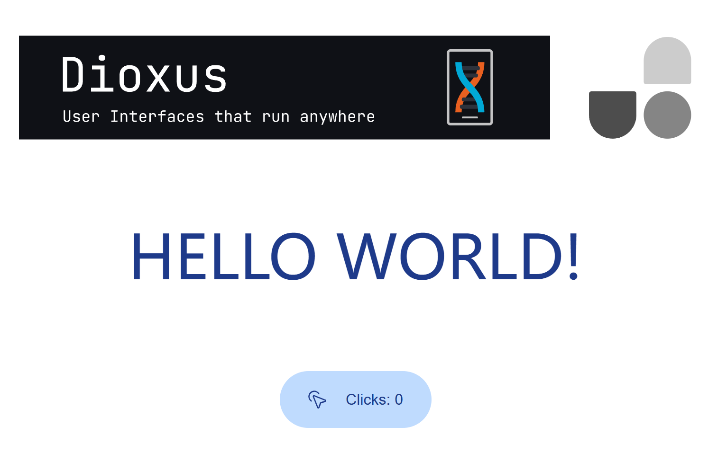

# A simple Dioxus template with UnoCSS



## Usage

> Tips:
> - The default platform is Web and you can change it in `Cargo.toml`
> - The template use `dioxus 0.6.0-alpha.4`


1. Install Package

   ```sh
   pnpm i
   ```

2. Dev

   You need two teminal to run these at same time

   ```sh
   pnpm dev
   dx serve
   ```

3. Build

   ```sh
   pnpm build
   ```

## Integrated plugins

- iconify/utils

  ```rs
  // Allow you use `i-icon:[name]` to use `assets/svg/[name].svg` as a icon
  div {
      class: "i-icon:click"
  }
  ```

- [transformer-directives](https://unocss.dev/transformers/directives#directives-transformer)

  ```css
  .custom-div {
    @apply text-center my-0 font-medium;
  }
  /* Will be transformed to */
  .custom-div {
    margin-top: 0rem;
    margin-bottom: 0rem;
    text-align: center;
    font-weight: 500;
  }
  ```

- [transformer-variant-group](https://unocss.dev/transformers/variant-group)

  ```rs
  // Make this
  div {
      class: "hover:bg-gray-400 hover:font-medium",
  }
  // To this
  div {
      class: "hover:(bg-gray-400 font-medium)",
  }
  ```


More config see `uno.config.ts`